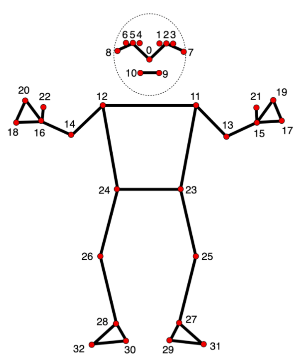

---

# Unity-Mediapipe-3DAvatar-MotionCaptureDriven

## 项目简介

`Unity-Mediapipe-Avatar-3DMotionCaptureDriven` 是一个基于 **Mediapipe** 和 **Unity 3D** 技术的虚拟角色动作捕捉系统。通过Mediapipe-Python捕捉用户的动作并驱动 Unity 中的虚拟角色，实现高效的实时 3D 动作捕捉体验。

支持使用 Mediapipe 捕捉人体骨骼和手势动作，控制虚拟角色的表现。

  


## 快速开始

### 环境要求

- Unity 2021.3.45f1
- Python 3.8+
- Mediapipe
- 相关的硬件支持，如 WebCam 或其它摄像头设备。
- 具体通过requirements.txt配置环境

### 安装步骤

1. 克隆该仓库：
   ```bash
   git clone https://github.com/catbobyman/Unity-Mediapipe-Avatar-3DMotionCaptureDriven.git
   ```
2. 配置Mediapipe-python运行环境：
   ```
   pip install -r requirements.txt
   ```


2. 导入 Unity 项目：
   - 打开 Unity Hub，点击“添加项目”，选择 `Unity-Mediapipe-Avatar-3DMotionCaptureDriven` 文件夹。
  
3. 安装依赖：
   - 在 Unity 编辑器中，确保所有必要的插件已安装
   - 必要unity插件:
   ```
   - burst
   - collection/jobs
   - magica cloth
   - Animation Rigging
   ```
     

4. 启动摄像头：
   - 确保启动摄像头应用，确保它能够捕捉到你正在进行的动作。

6. 运行项目：
   - 在 Unity 中点击“播放”按钮，观察虚拟角色如何跟随你实际的动作。

### 示例截图和动图

#### 1. 手部与躯干：


#### 2. 面部表情：


## 项目结构

```bash
Unity-Mediapipe-Avatar-3DMotionCaptureDriven/

AvartarMocap               
├── Assets                  
   ├── 3DModels             
   ├── Plugins              
   ├── Scenes              
   ├── Scripts
      ├── BoneNode.cs
      ├── Face.cs
      ├── GameController.cs
      ├── Hand.cs
      ├── Pose.cs
      ├── UDPDataManager.cs
      └── UpdateMethod.md
│ ...


MocapMod_Mediapipe
├── Detector/             # 检测的脚本
    ├── FaceLandmarkDetector.py 
    ├── PoseLandmarkDetector.py 
    ├── HandLandmarkDetector.py
    └── HandLandmarkDetector_New.py
├── Models/               # 存储模型
    ├── face_landmarker_v2_with_blendshapes.task    
    ├── hand_landmarker.task 
    └── pose_landmarker_full.task
├── .gitattributes       
├── DataController.py     
├── LICENSE               
├── ResultToJson.py       # 数据转换为 JSON
├── UDPServer.py          # UDP 通信模块
├── UDPServer_direct.py   # 直接式 UDP 通信模块
├── VisualUtilities.py    # 可视化工具
├── config.py             # 配置文件
├── main.py               # 主运行脚本
├── requirements.txt      # 项目依赖
```

## Google开发者文档
[mediapipe](https://ai.google.dev/edge/mediapipe/solutions/guide)

## mediapipe 脸部/身体/手部 landmark标图

### face


### pose


### hand


## 贡献

如果你有任何建议或想要贡献代码，欢迎提交 Pull Request 或在 Issues 页面报告 bug。

## 许可证

此项目采用 [MIT 许可证](LICENSE)。

---

你可以将这个README文件复制到你的项目根目录，并根据需要替换图片和动图链接。如果你有更多特定的要求或修改，随时告诉我！
